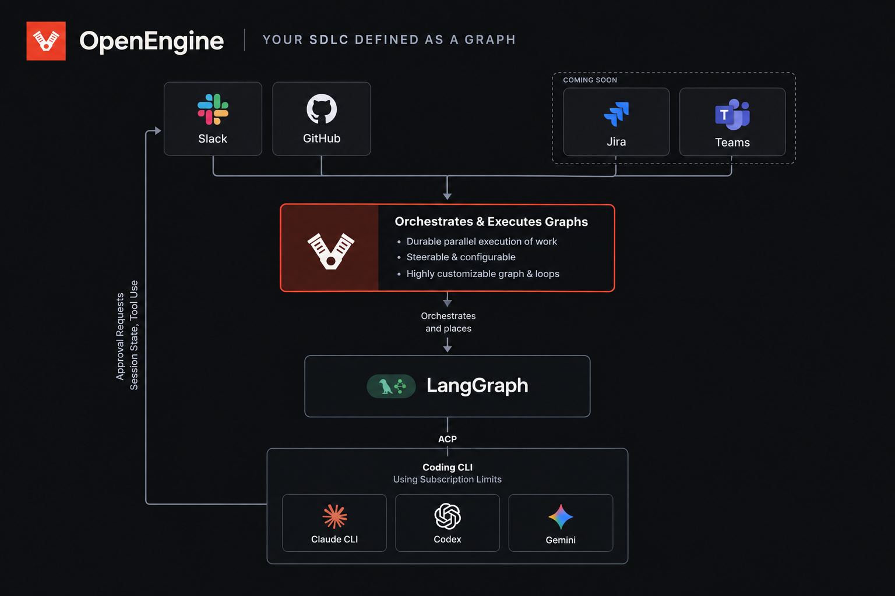
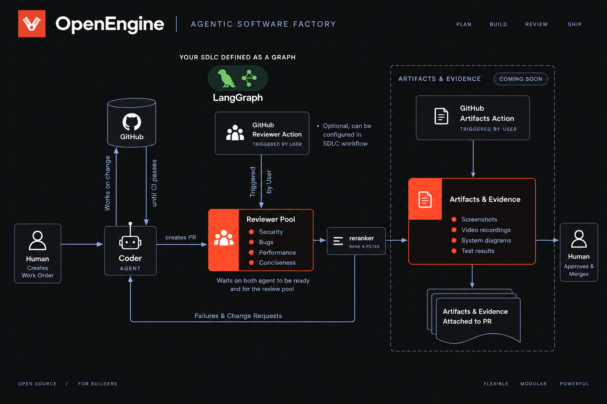

# OpenEngine

OpenEngine is a graph execution engine that meets you where you work.



We give you an out-of-the-box configuration to get you up and running. The out-of-the-box graph lives [here](./workflows/implementation_review_graph.py) and looks like this:
```
Implement -> Pool of Reviewers -> Reranking (Reduces noise) ->  Safe change 
```
## Getting started

Requires [uv](https://docs.astral.sh/uv/), Python 3.11+, and Node.js 20.19+.

OpenEngine reaches Codex and Claude over ACP, through the pinned `@agentclientprotocol/codex-acp` and `@agentclientprotocol/claude-agent-acp` adapters it launches with `npx`. They use your local Codex and Claude logins, so it can utilize your subscription limits instead of being provided an API key. Make sure you are logged in to Codex or Claude on this machine. 

First, clone the repo:
```bash
cd OpenEngine
uv sync --all-packages  # install all workspace packages, editable
npm --prefix apps/web install
npm --prefix apps/web run build
```
Then, run it by pointing it at your directory:
```bash
uv run \
  --project /path/to/openengine \
  --directory /path/to/your/project \
  --all-packages \
  engine-web
```
The production service defaults to `http://127.0.0.1:4364`. Verify its identity
and readiness after startup:
```bash
curl --fail http://127.0.0.1:4364/api/health
# {"service":"openengine","version":"0.0.0","ready":true,"api_version":1}
```
`version` is the installed `engine-web` package version. Health returns HTTP 503
until startup completes, if the configured graph runtime cannot open, or during
shutdown; otherwise it returns HTTP 200. This public endpoint requires no browser
login and does not check external provider credentials.

## Terminal diagnostics

CLI v1 contract: the binary is `engine`; its local service default is
`http://127.0.0.1:4364`; `--server` and profiles select remote services;
interactive terminals enter the workbench while all subcommands remain
scriptable. Specification authoring is outside this CLI contract.

The `engine` terminal client inspects a local or remote service:

```bash
engine status
engine doctor --json
engine status --server https://engine.example
```

It defaults to `http://127.0.0.1:4364`; `engine config server URL` saves a
server for the selected profile and `engine config profile NAME` switches
profiles. This first CLI release is diagnostic-only: local service startup and
interactive task workflows arrive in later stages. When the selected server is
the default local address and no compatible service is responding, `engine
status` starts one `engine-web` process and waits for its health endpoint. An
explicit `--server` is always probe-only.

In an interactive terminal, running `engine` opens the read-only workbench.
Type `/` to search the palette, then choose `/status`, `/threads`, `/web`, or
`/quit`. The matching scriptable commands are `engine status`, `engine threads`
(`--all` or `--archived`), and `engine task THREAD_ID`. Task creation, streaming,
and decisions remain later stages.

Start a terminal task with `engine run "describe the work"`; it creates a
conversation using the service's default agent and runner, then renders its
NDJSON progress. `--agent` and `--runner` select the service's available
configuration; `--repository` records the task's repository context while the
service workspace provider attaches the new conversation. `engine resume
THREAD_ID` reconnects to a current run.
Ctrl-C detaches the terminal stream only: it never sends the service a cancel
request.

While working on OpenEngine itself, run the development server instead:
```bash
uv run engine-dev
```

Trouble getting running? Want to say hello? Join our [Slack](https://join.slack.com/t/openenginegroup/shared_invite/zt-49mkaebkz-m86SbPAwn_QNMPqsSgioYQ).

## engine.toml
The main configuration file for OpenEngine. It's defined [here](./engine.toml).
While we use sensible defaults, if you need to configure engine, point it at a new 
`engine.toml` file.
```
uv run \
  --project /path/to/openengine \
  --directory /path/to/your/project \
  --all-packages \
  engine-web \
  --config /path/to/engine.toml
```

SQLite and PostgreSQL have independent Alembic histories. The PostgreSQL
history is currently a placeholder; the SQLite state store upgrades its
database on startup and can also be upgraded explicitly:

```bash
DATABASE_URL=sqlite:///conversations.sqlite3 uv run engine-migrate ## you shouldn't have to run this, happens automatically on startup
```

## GitHub connection

OpenEngine connects to GitHub to open pull requests and post review comments. The easiest method is to use the gh cli. 
The connection is set up once per machine through the Settings panel (gear icon
at the bottom of the sidebar).

### One-time setup: register an OAuth App

You need to create one GitHub OAuth App for your team. Each colleague then
pastes the client ID into their own Settings panel — no secrets are shared and
no server configuration is required beyond the step below.

1. Go to **github.com → Settings → Developer settings → OAuth Apps → New OAuth App**
2. Fill in the form (device flow does not use the callback URL, but GitHub
   requires one):
   - **Application name:** `OpenEngine`
   - **Homepage URL:** `http://localhost:4364`
   - **Authorization callback URL:** `http://localhost:4364`
3. Click **Register application**
4. On the app page, check **Enable Device Flow** and click **Update application**
5. Copy the **Client ID** (looks like `Ov23liXXXXXXXXXX`)

### Connecting

1. Open the Settings panel (gear icon in the sidebar)
2. Paste the Client ID into the field and click **Save**
3. Click **Connect GitHub**
4. The panel shows a short code and a link to **github.com/login/device**
5. Open that link, enter the code, click **Authorize**
6. The panel switches to **Connected** automatically

The OAuth token set is stored in the OS keychain (macOS Keychain, Secret
Service on Linux, Windows Credential Manager). When GitHub issues expiring
tokens, OpenEngine refreshes them automatically after an authorization failure
and retries the interrupted GitHub request once. Each colleague repeats steps
1–6 once with the same client ID.

## GitLab connection

OpenEngine can also connect to GitLab through OAuth. GitLab.com and each
self-managed instance have separate OAuth applications and credentials, so
create an application on the instance you intend to use.

### One-time setup: register an OAuth application

1. In GitLab, open **Avatar → Edit profile → Access → Applications**, then
   select **Add new application**.
2. Fill in the application:
   - **Name:** `OpenEngine`
   - **Redirect URI:** `http://localhost:7171/auth/redirect` (the device flow
     does not use it, but GitLab may require a value when registering the app)
   - **Scopes:** `api`
   - **Confidential:** leave unchecked
   - **Allowed grant types:** enable `device_code`
3. Save the application and copy its **Application ID**. Do not put the Client
   Secret into OpenEngine; the device flow uses only the Application ID.

### Connecting

1. Open the Settings panel and select **GitLab OAuth**.
2. Enter the instance URL. For GitLab.com, use `https://gitlab.com` — not a
   group or project URL.
3. Paste the Application ID and select **Save GitLab client ID**.
4. Select **Connect GitLab**. Open the displayed GitLab link and enter the
   device code displayed in OpenEngine. A phone is not required; the browser
   can be on the same computer.
5. GitLab confirms authorization and OpenEngine switches to **Connected**
   after its next poll.

The token pair is stored in the OS keychain per GitLab instance. OpenEngine
refreshes an expired access token once after an authorization failure, persists
the rotated credential pair, and retries the interrupted API request once.

For self-managed GitLab, device authorization requires GitLab 17.9 or later
and a public OAuth application with the `device_code` grant enabled. See
[GitLab's OAuth documentation](https://docs.gitlab.com/api/oauth2/) for
instance-specific configuration.

### Environment variable fallback

If you deploy OpenEngine on a server where no keychain is available, set the
client ID and a pre-generated token as environment variables instead:

```toml
# engine.toml
github_client_id = "Ov23liXXXXXXXXXX"
github_token     = "ghp_XXXXXXXXXXXX"
```

Or via environment variables:

```bash
GITHUB_CLIENT_ID=Ov23liXXXXXXXXXX GITHUB_TOKEN=ghp_XXXXXXXXXXXX uv run engine-web
```

For browser-based login setup, see the [GitHub login guide](docs/github-login.md).
To receive comments and merges from GitHub, see the
[GitHub webhooks guide](docs/github-webhooks.md).

## What is it.

We are building OpenEngine, a system for automating the SDLC and SOP. The key differentiator of OpenEngine is that it is a system for configuring token flow rates and planning according to a timeline.

OpenEngine is fundamentally this: A planning agent which projects the timeline and relative issue + milestone sizes based on the user's stated goals. Then, it automates the distribution and production of the code required to reach those milestones according to the token flow rates set by the engine operator. 

The key concepts are:
- A "Project". An end-to-end product that the operator is working on. Timelines and milestones are associated with this.
- A "Milestone". Some measurable outcome that you want to reach using code. Must come with acceptance criteria.
- A "WorkOrder". WorkOrders belong to a project+milestone. They are the tasks necessary to complete a milestone.

Fundamentally your project foreman schedules work, and dispatches work according to your budgets. You can use your subscription budgets, because OpenEngine drives Codex and Claude over ACP with your local logins. 



Remote clients can [create and immediately execute work orders through MCP](docs/remote-mcp.md), hosted on a Mac mini behind Tailscale Funnel.
